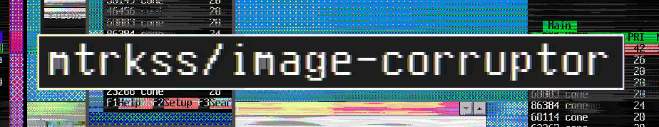
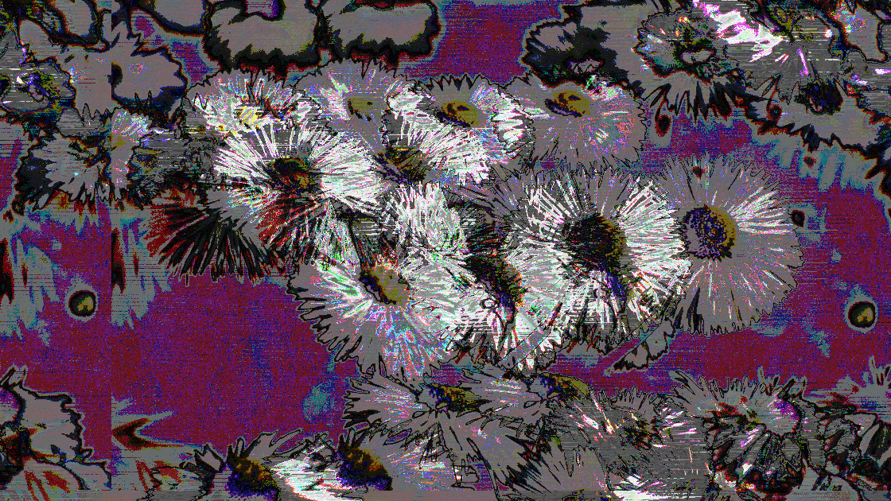
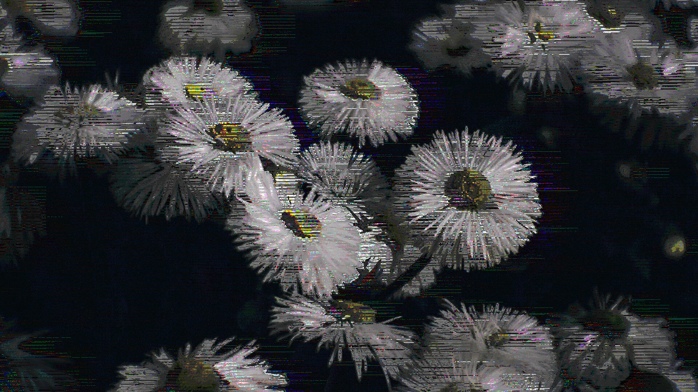

<p align=center>
    
</p>

-----------

This is a simple image corruptor that utilizes [ImageMagick](https://imagemagick.org/) and [FFmpeg](https://ffmpeg.org/).

# Latest Changelog
- Added proper OpenBSD support
- Added support for non-gnu OSes

# How 2 use dis?

1. Install the self explanatory dependencies
2. Run the script with `sh corruptor.sh` on Android or `./corruptor.sh` on other platforms

The only dependencies are FFmpeg, ImageMagick and POSIX commands such as head, tail and sed

<details>
	<summary>Built-in help message</summary>

```
"image-corruptor" is a simple POSIX Shell script for adding glitch effects to images e.g. corrupting them.
The corruption process utilizes ImageMagick, FFmpeg and Coreutils.

Options:

 VAR     SWITCH    FUNCTION
 input   (-i=)     - Input file
 output  (-o=)     - Output file
 filter  (-f=)     - FFmpeg audio filter (see ffmpeg.org/ffmpeg-filters.html)
 complex (-c=)     - Complex FFmpeg audio input
 format  (-a=)     - Intermediate audio format (see "ffmpeg -formats")
 rate    (-r=)     - Intermediate audio rate
 imargs  (-m=)     - Additional ImageMagick arguments
 src     (-s=)     - File with predefined variables
 debug   (--debug) - Enable simple debug info
 lavfi   (--lavfi) - Use lavfi complex input format
 alpha   (--alpha) - Enable alpha channel
 nolim   (--nolim) - Use an older image restoration alghorhithm

To test if everything works you can do
 $ convert -size 300x300 gradient:white-gray -rotate 45 /tmp/some.png
 $ ./corruptor.sh -i=/tmp/some.png -f=earwax,aecho -o=output.png
You should get a corrupted, stripey image from this.
```

</details>

The simplest way to corrupt an image with this script would be `./corruptor.sh -i=input.png -f=lowpass`

If no output file is specified, the name will be generated automatically.

# Technical
<details>
	<summary>Tested OSes</summary>

- Android
- MacOS
- Haiku OS
- FreeBSD
- OpenBSD
- Linux (Arch, NixOS, Alpine, Fedora)
</details>


<details>
	<summary>UNtested (but probably working) OSes</summary>

- NetBSD
- MirBSD
- Windows (With Cygwin or MSYS)

</details>

# Corrupted Images
`custom "acrusher=bits=16:samples=12"`
<p>
    
</p>

`custom "acrusher=bits=16:samples=200:mix=0.1"`
<p>
    
</p>

# TODO
- More testing, some features break the output images.
- Fix mtrkss/video-corruptor
